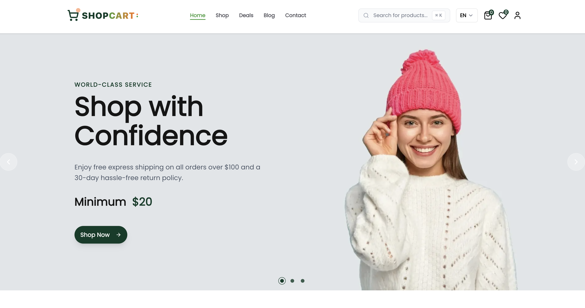

# 🛒 Sheba's Coffee - E-Commerce Platform

<div align="center">

[](https://nextjs.org/)
[](https://react.dev/)
[](https://www.typescriptlang.org/)
[](https://tailwindcss.com/)

**The complete, production-ready e-commerce platform built for modern businesses.**

[🚀 View Live Demo](https://shebascoffee.com) • [📖 Setup Guide](./SETUP.md)

</div>

---

## 📸 Platform Overview

[](https://shebascoffee.com)

Sheba's Coffee is a comprehensive e-commerce solution engineered for performance, scalability, and conversion. Built with the latest Next.js 16, React 19, and TypeScript stack, it offers an enterprise-grade shopping experience right out of the box.

Whether you're launching a coffee brand or specialty retail store, Sheba's Coffee provides the robust foundation you need to succeed.

---

## ✨ Key Features

### 🛍️ Advanced Product Management

- **Rich Catalog System**: Support for unlimited products with multiple images, detailed descriptions, and specifications.
- **Smart Variations**: Manage sizes, colors, materials, and other product variants effortlessly.
- **Inventory Tracking**: Real-time stock management with low-stock alerts.
- **Dynamic Categories**: Organize products into multi-level categories and collections.
- **Brand Management**: Dedicated brand pages and filtering.

### 🔍 Intelligent Discovery

- **Instant Search**: Lightning-fast search with predictive autocomplete.
- **Advanced Filtering**: Filter by price range, brand, rating, availability, and attributes.
- **Smart Sorting**: Sort by popularity, new arrivals, price, and customer rating.
- **AI Recommendations**: Related products suggestions to boost average order value.

### 🛒 Seamless Shopping Experience

- **Persistent Cart**: Cart contents saved across devices and sessions.
- **Quick Preview**: Slide-out cart drawer for instant access without leaving the page.
- **Wishlist**: Save functionality for future purchases.
- **Optimized Checkout**: Frictionless, secure checkout flow designed for conversion.
- **Guest Checkout**: Option to purchase without creating an account.

### 💳 Secure & Flexible Payments

- **Stripe Integration**: Enterprise-grade payment processing for credit/debit cards.
- **Clerk Payments**: Seamless integration for alternative payment methods.
- **Cash on Delivery**: Support for traditional payment models.
- **Multi-Currency**: Ready for international sales.
- **Tax Calculation**: Automated tax computation based on regions.

### 👥 User & Account Management

- **Secure Authentication**: Powerd by Clerk (Email, Google, GitHub, etc.).
- **User Dashboard**: Comprehensive profile management, order history, and saved addresses.
- **Order Tracking**: Real-time status updates from processing to delivery.
- **Wallet System**: Store credit functionality for refunds and rewards.
- **Loyalty Program**: Earn points on purchases and redeem for discounts.

### 📊 Powerful Admin Dashboard

- **Analytics Suite**: Visual reports on sales, revenue, traffic, and user growth.
- **Order Management**: Process orders, update statuses, and print invoices.
- **Customer Insights**: Detailed customer profiles and purchase history.
- **Review Moderation**: Approve, reject, and reply to user reviews.
- **Employee Management**: Role-based access control (Admin, Manager, Support).

### 🎨 Marketing & Engagement

- **Newsletter System**: Built-in subscription management and email campaigns.
- **Review System**: Rich customer reviews with star ratings and media uploads.
- **Blog Engine**: Integrated CMS for content marketing and SEO.
- **Banners & Promos**: Manage homepage sliders and promotional banners.

---

## 🛠️ Technology Stack

Our stack is chosen for performance, developer experience, and long-term maintainability.

| Layer          | Technology                                 |
| -------------- | ------------------------------------------ |
| **Framework**  | Next.js 16 (App Router, Turbopack)         |
| **Language**   | TypeScript 5+                              |
| **UI/Styling** | Tailwind CSS, Framer Motion, Shadcn UI     |
| **State Mgmt** | Zustand, React Context                     |
| **Database**   | Sanity CMS (Content), Firebase (User Data) |
| **Auth**       | Clerk                                      |
| **Payments**   | Stripe                                     |
| **Forms**      | React Hook Form, Zod                       |
| **Email**      | Nodemailer, Gmail OAuth2                   |

---

## 🚀 Quick Start Guide

Getting your store up and running is simple.

### Prerequisites

- Node.js 18.0 or higher
- npm, pnpm, or yarn
- Git

### Installation

1.  **Unzip the Project**
    Extract the downloaded file to your desired directory.

2.  **Install Dependencies**

    ```bash
    cd shebas-coffee
    npm install
    # or
    pnpm install
    ```

3.  **Environment Setup**
    Copy the example environment file and configure your keys.

    ```bash
    cp .env.example .env
    ```

    > ⚠️ **Important**: You must fill in the `.env` file with your own API keys for the application to function. See [SETUP.md](./SETUP.md) for detailed instructions on where to find each key.

4.  **Run Development Server**

    ```bash
    npm run dev
    ```

5.  **Open in Browser**
    Visit [http://localhost:3000](http://localhost:3000)

---

## 🌍 Internationalization (i18n) - 5 Languages Supported

Sheba's Coffee comes pre-configured with support for **5 languages** out of the box, making it easy to launch your store globally.

### Supported Languages

1.  **English** (`en`) - Default
2.  **Italian** (`it`)
3.  **French** (`fr`)
4.  **Hindi** (`hi`)
5.  **Arabic** (`ar`) - RTL Support included
6.  **Amharic** (`am`)

### How to Switch or Add Languages

Configuration is managed in `i18n-config.ts` and dictionary files.

1.  **Switch Default Language**:
    Open `i18n-config.ts` and change `defaultLocale`:

    ```typescript
    export const i18n = {
      defaultLocale: "fr", // Change to your preferred language
      locales: ["en", "it", "fr", "hi", "ar","am"],
    } as const;
    ```

2.  **Add New Language**:
    - Add the locale code to `locales` array in `i18n-config.ts`.
    - Create a new JSON file in `dictionaries/` folder (e.g., `es.json` for Spanish).
    - Copy content from `en.json` and translate the values.

---

## 📚 Documentation

For detailed configuration instructions, please refer to the [**SETUP.md**](./SETUP.md) guide included in this package. It covers:

- Sanity CMS Project creation & import
- Clerk Authentication setup
- Stripe Payment configuration
- Firebase database connection
- Admin user creation

---

## 📁 Project Structure

```
shebas-coffee/
├── app/                  # Next.js App Router (Pages & Layouts)
│   ├── (client)/         # Public storefront pages
│   ├── (admin)/          # Admin dashboard pages
│   └── (auth)/           # Authentication pages
├── components/           # Reusable React components
├── lib/                  # Utility functions & configurations
├── sanity/               # Sanity CMS schemas & config
├── public/               # Static assets (images, fonts)
├── actions/              # Server Actions for data mutation
├── hooks/                # Custom React hooks
└── types/                # TypeScript type definitions
```

---

## 📄 License

**Commercial License**
This software is provided under a commercial license. You are free to use it for your own business or a client project. Redistribution or resale of the source code is strictly prohibited.

---

## 🤝 Support

If you encounter any issues or have questions about the setup:

- **Documentation**: Check the [SETUP.md](./SETUP.md) file first.
- **Email Support**: Contact us at [support@shebascoffee.com](mailto:support@shebascoffee.com).

<div align="center">
  <p>Thank you for choosing Sheba's Coffee!</p>
  <p>© 2026 shebascoffee.com. All rights reserved.</p>
</div>
